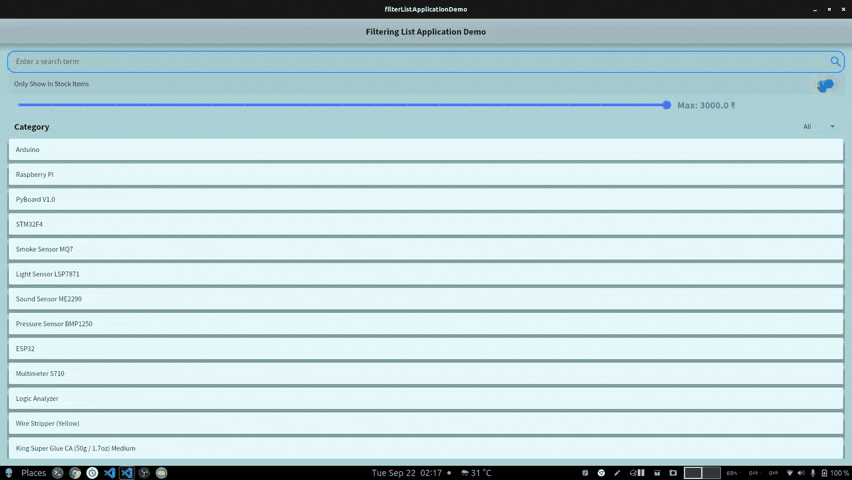

`filterListApplicationDemo` is a demo application, which can be further developed into a shopping application.

It is designed to have a responsive UI, meaning It can work in most mobile devices (Without having to redefine all size parameters) It is developed by keeping in mind the Desktop Environment as Well (Tested with Linux | Windows Machine :computer:).

**Usage :collision:**
---
> This  application can be further developed into making a Shopping Application

**Widget Tree :thought_balloon:**
---

**GIPHs**
---
> **Search Filter**

> **Responsive UI Demo**

> **Cateogry-wise Filtering**

**Acknowledgements**
---

+ [Sample App For Infinite List From Flutter](https://github.com/flutter/samples/tree/master/infinite_list)  
+ Thank You for giving us a way to design an Application Source Code, which can more or less can be used on virtually any platform.